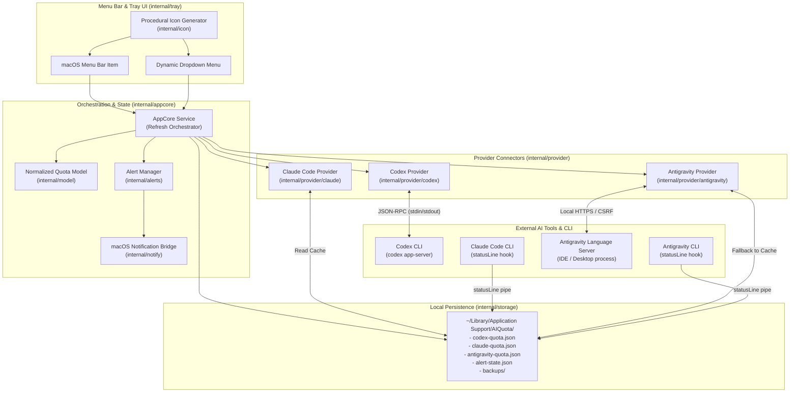
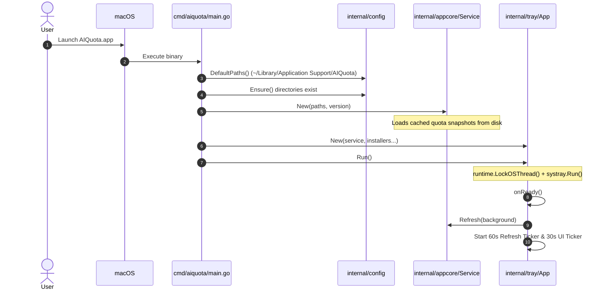
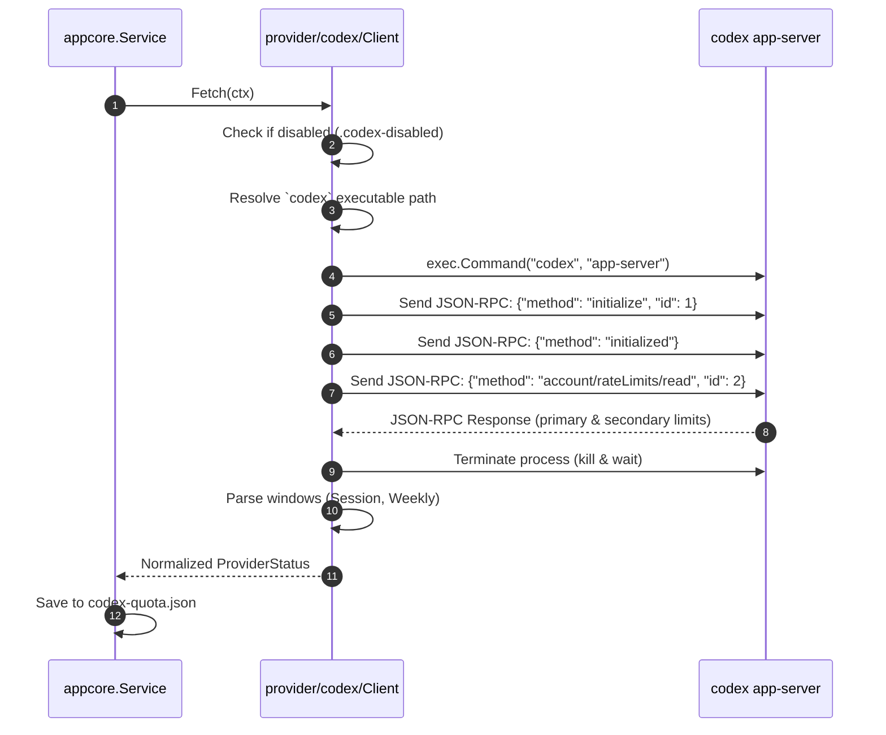
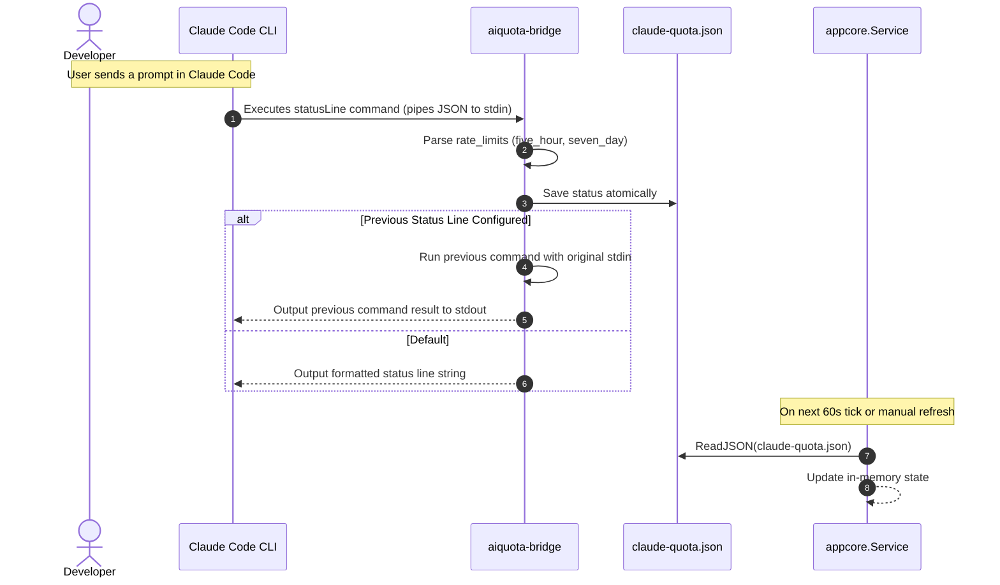
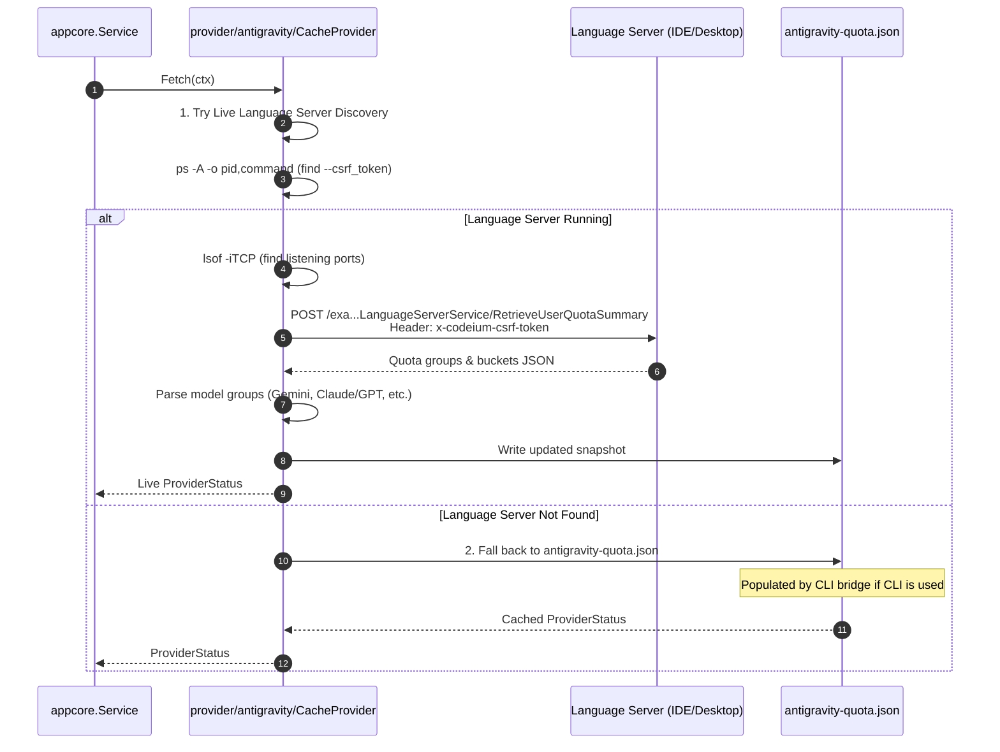
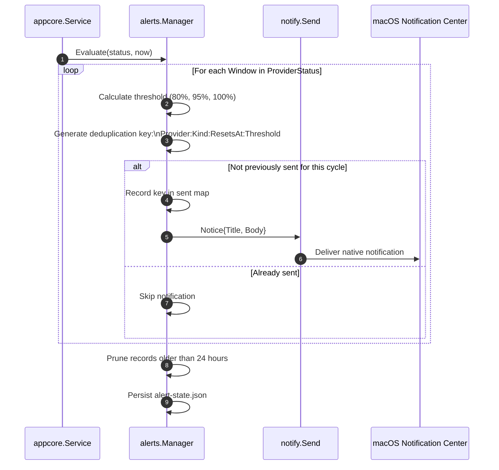

# AI Quota Architecture & Design

This document details the system design, core principles, data flows, and integration mechanisms of **AI Quota**.

---

## 1. Design Philosophy & Core Principles

AI Quota is a lightweight macOS menu bar utility designed to give developers immediate visibility into their AI tool subscription quotas (Codex, Claude Code, and Google Antigravity).

### Core Principles

1. **Zero Credentials / Privacy First**:
   - The app **never** handles, stores, or transmits API keys, OAuth tokens, user credentials, conversation history, or code snippets.
   - It only reads rate-limiting and quota percentage metadata.

2. **Official & Non-Invasive Integration**:
   - No web scraping, no unauthorized cloud APIs, no proxying of user AI traffic.
   - Integrates exclusively through local interfaces provided by the AI tools:
     - **Codex**: Local JSON-RPC over `codex app-server`.
     - **Claude Code**: Documented `statusLine` hook in `~/.claude/settings.json`.
     - **Google Antigravity**:
       - *Live Discovery*: Queries the local Antigravity Language Server (IDE / Desktop).
       - *CLI Hook*: Intercepts status line payloads via `~/.gemini/antigravity-cli/settings.json`.

3. **Non-Destructive Configuration with Safe Rollback**:
   - Modifying settings files (for Claude Code and Antigravity CLI) always creates a timestamped backup before any change.
   - Disabling tracking restores the exact prior configuration.
   - If settings were modified externally while tracking was enabled, the app detects the discrepancy and refuses to overwrite.

4. **Normalized Quota Domain**:
   - Each provider reports quota in different schemas (e.g. `used_percentage`, `remainingFraction`, 5-hour, 7-day, model buckets).
   - The core normalizes all providers into a unified model (`model.ProviderStatus` and `model.Window`) with uniform severity levels and countdown calculations.

5. **Resource Efficiency & Battery Friendly**:
   - Uses zero CPU when idle.
   - Refreshes every 60 seconds (or on user click).
   - Generates UI icons dynamically in-memory using pure Go without heavy graphics dependencies or web views.

---

## 2. High-Level System Architecture



---

## 3. Component Breakdown

| Package | Purpose | Key Responsibilities |
| :--- | :--- | :--- |
| `cmd/aiquota` | Entry Point & Bridge Multiplexer | Parses CLI flags (`--claude-statusline`, `--antigravity-statusline`, `--version`). Bootstraps app core and launches tray event loop. |
| `internal/model` | Domain Model | Defines `Provider`, `Window`, `ProviderStatus`, `Severity`, normalization logic, and relative time countdown formatting. |
| `internal/appcore` | Application Service | Manages in-memory provider status cache, concurrent refresh orchestration across providers, and triggers alert evaluation. |
| `internal/provider` | Extension Interface | Standard interface `Provider` (`ID()`, `Fetch(ctx)`). |
| `internal/provider/codex` | OpenAI Codex Connector | Manages `codex app-server` subprocess, sends JSON-RPC initialization and rate-limit queries, parses response, and manages enable/disable toggle. |
| `internal/provider/claude` | Anthropic Claude Code Connector | Provides `aiquota-bridge` for Claude status line hook, parses JSON payload, manages settings backup/restore, and reads cache. |
| `internal/provider/antigravity` | Google Antigravity Connector | Dual-mode connector: discovers running Antigravity Language Server over localhost HTTPS, or falls back to status-line hook cache. |
| `internal/alerts` | Threshold & Deduplication | Evaluates quota against 80%, 95%, 100% used thresholds. Deduplicates notices within a reset cycle. |
| `internal/notify` | Native Notifications | Sends macOS user alerts using native bridges (`osascript` / UserNotifications). |
| `internal/icon` | In-Memory Rendering | Generates RGBA tray icon gauges and status dots procedurally as PNG bytes. |
| `internal/storage` | Atomic File I/O | Reads and writes JSON files safely using temporary files and atomic renames. |
| `internal/tray` | Menu Bar Presentation | Handles menu creation, event loops (user clicks, refresh tickers), relative countdown updates, and provider submenus. |
| `internal/config` | Paths & Configuration | Manages paths in `~/Library/Application Support/AIQuota` and home directory tool settings. |

---

## 4. End-to-End Execution Flows

### 4.1. Application Lifecycle & Startup



---

### 4.2. Quota Fetching Flows

#### A. Codex: Active Subprocess via JSON-RPC



#### B. Claude Code: Passive Status Line Hook & Bridge



#### C. Google Antigravity: Dual Mode (Language Server + CLI Bridge)



---

### 4.3. Menu Bar UI Rendering & Status Indicators

The tray UI renders two distinct layers:
1. **Menu Bar Indicator**:
   - Finds the **most urgent** remaining percentage among all active, non-expired quota windows across all enabled providers.
   - Dynamically updates the menu title: e.g., `Antigravity 45%` or `Codex 12%`.
   - Generates an in-memory PNG icon with the corresponding severity color.
2. **Dropdown Menu Hierarchy**:
   - **Provider Sections**: Active providers display their respective quota buckets (e.g. Session, Weekly, Gemini Flash, Claude 3.5 Sonnet) with color-coded dot icons, remaining percentages, and relative reset countdowns (`resets in 3h 15m` / `resets in 4d 2h`).
   - **Status & Control**: Last update time (`Updated 2 min ago`), manual `↻ Refresh now` button.
   - **🧩 Providers Submenu**: Allows enabling/disabling tracking for each individual provider with connection status indicators (`🟢 Tracking active`, `⏳ Waiting for quota data`, `⚪ Tracking disabled`).

#### Severity Levels

| Level | Remaining % | Menu Dot | Description |
| :--- | :--- | :---: | :--- |
| **Healthy** | `> 20%` | 🟢 | Normal operation. |
| **Warning** | `6% – 20%` | 🟡 | Quota running low; alert triggered once at 80% usage. |
| **Critical** | `1% – 5%` | 🔴 | Quota almost exhausted; alert triggered once at 95% usage. |
| **Exhausted** | `≤ 0%` | ⛔ | Quota exhausted; alert triggered once at 100% usage. |
| **Waiting** | Reset passed | ⚪ | Waiting for fresh provider request to report new window. |

---

### 4.4. Alert & Deduplication Flow



---

## 5. Local Storage & File Layout

All application data is isolated under the user's application support directory:
`~/Library/Application Support/AIQuota/`

```text
~/Library/Application Support/AIQuota/
├── bin/
│   ├── aiquota-bridge                 # Symlink or executable for Claude Code status line
│   └── aiquota-antigravity-bridge     # Symlink or executable for Antigravity CLI status line
├── codex-quota.json                   # Latest normalized Codex quota snapshot
├── codex-disabled                     # Marker file present when Codex tracking is disabled
├── claude-quota.json                  # Latest normalized Claude Code quota snapshot
├── claude-statusline-backup.json      # Original Claude Code status line command backup
├── antigravity-quota.json             # Latest normalized Antigravity quota snapshot
├── antigravity-statusline-backup.json # Original Antigravity status line command backup
└── alert-state.json                   # Deduplication map of sent notification keys
```

No sensitive user data, auth tokens, or telemetry leave the local machine.
